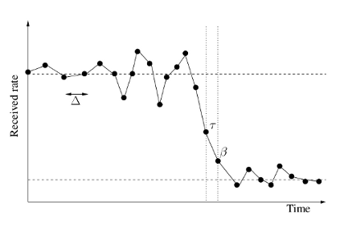
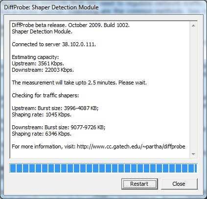

# Traffic Shaping Data analysis

## Using Shaperprobe Worldwide Data
<br/>

### By Framartin — `r format(Sys.time(), "%d/%m/%Y")`

---

Use your arrow keys to change slides.

Each part is vertically organised. You can change part horizontally.

```{r, echo = FALSE, warning=FALSE, message=FALSE}

#############################################################
# This file is a R Markdown file. It contains both markdown and R code which needs to be evaluated. It is used to automatically generate a html page of data analysis of Shaperprobe data. 
#############################################################

# R packages needed : vcd, rworldmap, xtable, lattice, chron, grid
# Be sure to have these installed before trying to compile this file

# TODO :
# Faire différentes plages de dates ?
# TS rates by weeks/years to see the evolution
# Retirer cache = TRUE

#############################################################

# import data exported from MySQL in CSV
classes = c("character", "character", "character", "character", "integer", "numeric", "logical", "integer", "integer", "integer", "logical", "integer", "integer", "integer", "integer", "integer", "numeric", "numeric", "integer", "character", "character", "character", "character", "character", "character")  # stock variable class to optimise reading data into R 
## Variables type :
# ip              : "character"
# date_test       : "character"
# local_date_test : "character"
# server          : "character"
# client_version  : "integer"
# sleeptime       : "numeric"
# upshaper        : "logical"
# minupburstsize  : "integer"
# maxupburstsize  : "integer"
# upshapingrate   : "integer"
# downshaper      : "logical"
# mindownburstsize: "integer"
# maxdownburstsize: "integer"
# downshapingrate : "integer"
# upmedianrate    : "integer"
# downmedianrate  : "integer"
# upcapacity      : "numeric"
# downcapacity    : "numeric"
# data_quality    : "integer"
# country_code    : "character"
# country_name    : "character"
# as_number       : "character"
# country_code_as : "character"
# isp_id          : "character"
# isp_name        : "character"

# import data : this can take one minute
shaperprobe_all=read.table("data_shaperprobe.csv", header = TRUE, sep = ";", quote = "" , dec = ".", na.strings = "NULL" , colClasses=classes ) 

#str(shaperprobe_all) # uncomment to check

shaperprobe_ok=shaperprobe_all[shaperprobe_all$data_quality==0 | is.na(shaperprobe_all$data_quality),] # we keep only data which are good or not qualified (delete absurd and doubtful lines)
rm(shaperprobe_all) # to save RAM

# calculate up ou down shaper
shaperprobe_ok$upordownshaper = (shaperprobe_ok$upshaper) | (shaperprobe_ok$downshaper)
# calculate the mean of the minimum of burstsize and the maximum burstsize of Up test 
shaperprobe_ok$meanupburstsize = (shaperprobe_ok$minupburstsize + shaperprobe_ok$maxupburstsize)/2  # there is no NA in these 2 variables (if we have only one value for the burstsize, the two are copied in min and max)
# idem for Down test
shaperprobe_ok$meandownburstsize = (shaperprobe_ok$mindownburstsize + shaperprobe_ok$maxdownburstsize)/2
```

---

<section>
# Net Neutrality

<br/>
<a href="#" class="image navigate-down">
  
</a>

</section>

<section>
## Definition
<br/>

4 founding principles
<br/>

<div style="text-align: left;">
Transmit data:
</div>
* without looking at it
* without discriminating by source or destination
* without favoring a way to communicate (protocol)
* without distorting content

<br/>
<blockquote style="text-align: right;">Benjamin Bayard</blockquote>

</section>

<section>

Net neutrality is the principle that Internet Service Providers and governments should treat all data on the Internet equally, not discriminating or charging differently by user, content, site, platform, application, type of attached equipment, and modes of communication.

<br/>
<blockquote style="text-align: right;"><a href="https://en.wikipedia.org/wiki/Network_neutrality">Wikipedia</a></blockquote>

</section>

<section>
## Examples
<br/>

* blocking websites/censorship
* traffic shaping
* traffic prioritization
* real-time content modification
</section>

<section>
## Threats
<br/>

### Business
Restrain competition and innovation

### Politics
Big brother vs. digital rights and freedoms

### Technique
Quality of services

</section>

---

<section>
# Traffic Shaping

<br/>
<a href="#" class="image navigate-down">
  
</a>

</section>

<section>
## What is Traffic Shaping ?

<br/>
* A specific technique to limit the speed of connections in a computer network
* Concretely, it's a way for your Internet Service Provider to artificially limit the speed of your Internet connection
* Using Traffic Shaping is a violation of Net Neutrality if the user cannot configure it

<br/>
Learn more about traffic shaping on [Wikipedia](https://en.wikipedia.org/wiki/Traffic_shaping)

</section>

<section>


The image below comes from the paper wrote by Shaperprobe developers to illustrate a typical example of traffic shaping ([pdf](http://netinfer.com/shaperprobe-imc11.pdf)).
</section>

--- 

<section>
# Shaperprobe
# Software

<br/>
<a href="#" class="image navigate-down">
  
</a>

</section>

<section>
## What is Shaperprobe ?

A software testing traffic shaping

**Execute Shaperprobe** on your own internet connection to test traffic shaping and improve results shown here

[Shaperprobe on the Measurement Lab](http://www.measurementlab.net/tools/shaperprobe)



</section>

<section>
## Some technical stuff

<div style="text-align: left;">
Shaperprobe is:
</div>
* testing traffic shaping by active probing method…
* …in upload and in download
* a free software (GPL licence)
* multi-platform (Windows/Linux/MacOSX/FreeBSD)

<br/>
Data are stored on the MeasurementLab platform and are publicly accessible under the CC-0 licence (public domain).

<br/>
Note that IP addresses are stored (it allows us to find localizations and ISP).

</section>

<section>
Shaperprobe's test procedure works like this:
<br/>

1. connection to the closest available MLab's server
2. estimation of the upload and download speed
3. sending and receiving packets of fixed size for about 2.5 minutes (we have time series of trains speed)
4. detection (or not) of a significant and lasting fall (ie. traffic shaping)

<br/>
Learn more about Shaperprobe on [Netinfer](http://netinfer.com).
</section>

<section>
## Collected variables
<br/>

* IP address
* date and hour
* traffic shaping in upload or download (yes/no)
* burstsize: number of Bytes before speed drop
* speed after the drop (if so)
* mean speed (if no traffic shaping)
* capacity of connection (in up and down)
* others

</section>

---

<section>
# Data presentation

<br/>
<a href="#" class="image navigate-down">
  
</a>

</section>

<section>

* Dates of tests expand from `r format.Date(min(shaperprobe_ok$date_test), "%d %b %Y")` to `r format.Date(max(shaperprobe_ok$date_test), "%d %b %Y")`
* Total number of tests: `r nrow(shaperprobe_ok)`
* Done by `r length(unique(shaperprobe_ok$ip))` different IP addresses
* From `r length(unique(shaperprobe_ok$country_name))` different countries
* And `r length(unique(shaperprobe_ok$isp_name))` distinct Internet Service Provider (ISP)
* Collected by `r length(unique(shaperprobe_ok$server))` servers

<br/>
<small>
This presentation is automatically generated once a week, with new data. The code used to download, parse, treat data, and generate html is available on [github](https://github.com/Framartin/MeasureNetNeutrality/tree/master/MLab/ShaperProbe).
</small>

</section>

<section>
Histogram of numbers of tests by days

```{r histogrammesdates, echo=FALSE, fig.width=10, fig.height=7, warning=FALSE}
date_test = as.Date(shaperprobe_ok$date_test, "%Y-%m-%d %H:%M:%S")
hist(date_test, "days", col = "firebrick", freq = TRUE, xlab = "Date of test", main = "Number of tests by days", format = "%b %Y")
#hist(date_test, "weeks", col = "firebrick", freq = TRUE, xlab = "Date of test", main = "Number of tests by weeks", format = "%b %Y")

# other representation using ggplot2
#library(ggplot2)
#library(zoo)
#shaperprobe_ok$dateOnly = gsub(" [0-9]+:[0-9]+:[0-9]+","",shaperprobe_ok$date_test)
#ggplot(data = shaperprobe_ok,aes(x = as.Date(as.yearmon(dateOnly)))) + 
#    geom_bar() + 
#    xlim(as.Date(c('2009-01-01','2015-01-01')))
```

</section>

<section>
Calendar heatmap of number of tests by days

```{r, echo=FALSE, fig.width=10, fig.height=7, warning=FALSE, message=FALSE}
# calendar heatmap
source("static/calendarHeatMap.R")
numberTestsByDays = table(as.Date(shaperprobe_ok$date_test, "%Y-%m-%d"))
calendarHeat(names(numberTestsByDays), numberTestsByDays, varname="number of tests")
# TODO: improve visualisation : there is large peak witch scale down other variations
# we cut after 1500 tests for one day :
#numberTestsByDays[numberTestsByDays > 1500] = 1500
#calendarHeat(names(numberTestsByDays), numberTestsByDays, varname="the number of tests")

rm(date_test)
```
</section>

<section>

Data are qualified into 3 categories:

* not qualified (by default)
* subject to doubt
* false (or absurd)

according to criteria justified by technical considerations and statistical exploratory analysis

<br/>
In the following, we don't use doubtful and absurd data.
</section>

<section>
If you want to make your own data analysis, you can download data in a clean CSV file [here](http://respectmynet.eu/) **TODO**. 
</section>

---

<section>
# Quick overview of 
# global results

<br/>
<a href="#" class="image navigate-down">
  
</a>

</section>

<section>
```{r, echo=FALSE}
frequency_table = table(shaperprobe_ok$downshaper, shaperprobe_ok$upshaper)/nrow(shaperprobe_ok)*100
```

### Traffic shaping in upload or in download
<br/>

in %  |  | Traffic Shaping | in Upload
------------- | ------------- | ------------- | -------------
 |   | False | True
<span style="text-shadow: 1px 1px 2px #FFF">Traffic Shaping</span>  | False  | `r round(frequency_table[1,1], digits = 2)` | `r round(frequency_table[1,2], digits = 2)`
<span style="text-shadow: 1px 1px 2px #FFF">in Download</span>  |  True   | `r round(frequency_table[2,1], digits = 2)` | `r round(frequency_table[2,2], digits = 2)`

<br/>
Percentages of tests detecting traffic shaping

 
```{r, echo=FALSE}
# other representation
#df.tab = with(shaperprobe_ok, table(downshaper, upshaper))
#df.tab[,] = paste(df.tab, ' (', 100*prop.table(df.tab), '%)', sep='')
#df.tab
```
</section>

<section>
## Mosaic plot

```{r mosaicplotshaper, echo=FALSE, message=FALSE}
# Mosaic plot
attach(shaperprobe_ok)
library(vcd)
mosaic(upshaper~downshaper, shade=TRUE)
detach(package:vcd)
```
</section>

<section>
These results are computed for all tests.

<br/>
As some countries are over-represented, numbers above are not necessarily a good representation of the proportion of worldwide Internet connections subject to traffic shaping
</section>


---

<section>
# World Maps of
# Traffic Shaping 

<br/>
<a href="#" class="image navigate-down">
  
</a>

</section>

<section>
World map of rates of traffic shaping detected in upload or in download

```{r, include=FALSE}

data = read.csv("results_byCountry_shaperprobe.csv", sep = ";", na.strings="NULL") # becareful to have max_data_quality = 0 OR NULL

data = data[,c(1,2,4,5,6,7,8,9,10)]  # delete useless variable
data$country_code = as.character(data$country_code) # from factor to character
data$country_name = as.character(data$country_name)
data$up_or_down_shape_rate = as.numeric(data$up_or_down_shape_rate) # convert into numerics
data$up_speed_reduction_rate = as.numeric(data$up_speed_reduction_rate)
data$down_speed_reduction_rate = as.numeric(data$down_speed_reduction_rate)

# Represent only countries with at least 50 different IP adresses and 100 tests. We do not represent A1  : Anonymous Proxy
data_ok = data[data$number_ip > 50 & data$number_tests > 100 & data$country_code != "A1",]
data_ok$country_code[data_ok$country_code == "<NA>"] = "NA" # problem with Namibia
rm(data)

# TODO : faire des plusieurs plot avec les différentes plages de données

# preparation of the world map
library(rworldmap)
sPDF = joinCountryData2Map(data_ok, joinCode = "ISO2", nameJoinColumn = "country_code")  # add ", verbose = T" to see errors
```

```{r countrymapshaperate, fig.width=12, fig.height=9, echo=FALSE, message=FALSE, warning=FALSE, error=FALSE}
#par(mai=c(0,0,0.2,0),xaxs="i",yaxs="i")

# colored areas with blue oceans :
mapCountryData(sPDF, nameColumnToPlot="up_or_down_shape_rate", oceanCol="lightblue", 
               missingCountryCol="gray90", mapTitle = "Rate of Up or Down Traffic Shaping detected" )
```

</section>

<section>
Zoom in Eurasia:

```{r countrymapshaperatezoom, fig.width=12, fig.height=9, echo=FALSE, message=FALSE, warning=FALSE, error=FALSE}
# colored areas with blue oceans in eurasia:
mapCountryData(sPDF, nameColumnToPlot="up_or_down_shape_rate", oceanCol="lightblue", mapRegion="eurasia",
               missingCountryCol="gray90", mapTitle = "Rate of Up or Down Traffic Shaping detected" )
```
</section>

<section>
Zoom in Oceania:

```{r, fig.width=12, fig.height=9, echo=FALSE, message=FALSE, warning=FALSE, error=FALSE}
# colored areas with blue oceans in oceania:
mapCountryData(sPDF, nameColumnToPlot="up_or_down_shape_rate", oceanCol="lightblue", mapRegion="oceania",
               missingCountryCol="gray90", mapTitle = "Rate of Up or Down Traffic Shaping detected" )
```

</section>

<section>
Colors are defined as above, and the size of circles represents the number of tests done in the country

```{r bubblesmapshaperate, fig.width=12, fig.height=9, echo=FALSE, message=FALSE, warning=FALSE, error=FALSE}
# bubbles map:
mapBubbles( dF=sPDF, nameZSize="number_tests", nameZColour="up_or_down_shape_rate", 
            legendTitle="Number of tests", colourLegendTitle="Up or down shape rate",
            colourPalette="heat", oceanCol="lightblue", landCol="wheat", symbolSize = 2.5, numCats = 5, catMethod = "pretty", legendHoriz=T)
```
</section>

<section>
Zoom in Eurasia:

```{r bubblesmapshaperatezoom, fig.width=12, fig.height=9, echo=FALSE, message=FALSE, warning=FALSE, error=FALSE}
# bubbles map in eurasia:
mapBubbles( dF=sPDF, nameZSize="number_tests", nameZColour="up_or_down_shape_rate", 
            legendTitle="Number of tests", colourLegendTitle="Up or down shape rate", mapRegion="eurasia",
            colourPalette="heat", oceanCol="lightblue", landCol="wheat", symbolSize = 2.5, numCats = 5, catMethod = "pretty", legendHoriz=T)
```
</section>

<section>

### Note
<br/>

Countries having less than 100 tests or less than 50 different IP addresses are not drawn

</section>

---

<section>
# Numeric results
# by country

<br/>
<a href="#" class="image navigate-down">
  
</a>

</section>

<section>
### Variables

Name | Description   | Unit
------------- | ------------- | -------------
**Up or down shape rate** | Rate of connection with traffic shaping in upload or in download | % 
Up shape rate | Idem only in upload | %
Down shape rate | Idem only in download | %
Up speed reduction rate | Rate of the reduction of the upload speed due to traffic shaping relative to the capacity of the connection when detected | %
Down speed reduction rate | Idem in download | %
Number IP | Number of distinct IP addresses | -
Number tests | Number of tests (Shaperprobe runs)  | -

</section>


<section>
## Results aggregated by country

<div style="text-align: left;">
Interpret results:
</div>
* You should look mainly at the variable *Up or down shape rate*
  * Be careful to errors: below 15-20% we don't really know (but high chance there is **no** Traffic Shaping in network)
  * More than 40% is a lot of Traffic Shaping
* *Up speed reduction rate* and *Down speed reduction rate* give an idea of the drop size
  * It makes sense only when Traffic Shaping rate is significant
* To estimate the reliability of these results, take a look at the number of distinct IP addresses and tests

</section>

```{r, results='asis', echo=FALSE}
library(xtable) 
data_printed = data_ok
# convert in %
data_printed$up_or_down_shape_rate = 100*data_printed$up_or_down_shape_rate
data_printed$up_shape_rate = 100*data_printed$up_shape_rate
data_printed$down_shape_rate = 100*data_printed$down_shape_rate
data_printed$up_speed_reduction_rate = 100*data_printed$up_speed_reduction_rate
data_printed$down_speed_reduction_rate = 100*data_printed$down_speed_reduction_rate


# coloration des cases dont up ou down shape rate est > à 30% : buggé
#data_printed$up_or_down_shape_rate[data_printed$up_or_down_shape_rate > 0.3 ] = gsub("(.*)", '<font color = "40E0D0">\\1</font>', data_printed$up_or_down_shape_rate[data_printed$up_or_down_shape_rate > 0.3 ])
data_printed[,c(3,4,5)] = data_printed[,c(5,3,4)] # we put down or up before down only and up only
colnames(data_printed) = c("","Country Name","Up or down shape rate","Down shape rate","Up shape rate","Up speed reduction rate",
                           "Down speed reduction rate","#IP","#tests")

for (i in 1:(nrow(data_printed)%/%9+1)) {
  temp = data_printed[(9*(i-1)+1):min(9*i,nrow(data_printed)),]
  cat('<section>')
  print(xtable(temp), type='html', include.rownames=FALSE, comment=FALSE)
  cat('</section>')
}
# essai de coloration par ajout de style mais buggé
#table.html = capture.output(print(xtable(data_printed), type='html', include.rownames=FALSE))
#table.html = gsub('<TR>', '<TR style="background-color: #E5E4E2;">', table.html)
#cat(table.html, , sep="\n")
#rm(list=c("data_ok","data_printed"))
``` 

<section>

## Calculation method

We have used weighted average to approximate the rate of internet connections having traffic shaping.

We cannot directly compute the mean of tests by country, because some IP addresses have done more than 3000 tests. So it leads to a bias.

Instead we compute means of binary variables by IP address, and then we aggregate by country.

For example, if we have some errors and for 3 tests Shaperprobe have detected 2 without traffic shaping and one with, this IP address have a mean of 1/3.

</section>

---

<section>
# Traffic Shaping
# by ISP

<br/>
<a href="#" class="image navigate-down">
  
</a>

</section>

<section>

### Variables

Name | Description   | Unit
------------- | ------------- | -------------
**Up or down shape rate** | Rate of connection with traffic shaping in upload or in download | % 
Up shape rate | Idem only in upload | %
Down shape rate | Idem only in download | %
Up speed reduction rate | Rate of the reduction of the upload speed due to traffic shaping relative to the capacity of the connection when detected | %
Down speed reduction rate | Idem in download | %
Number IP | Number of distinct IP addresses | -
Number tests | Number of tests (Shaperprobe runs)  | -


</section>


<section>
## Results aggregated by ISP

<div style="text-align: left;">
Interpret results:
</div>
* if an ISP have an _Up or down shape rate_ greater than approximately 30%, there is an _high probability_ that your ISP is performing traffic shaping on its network
* if an ISP have an _Up or down shape rate_ lower than approximately 30%, _we cannot know_ if an ISP has implementing traffic shaping <small>It can be the results of errors, or that traffic shaping is implemented in only a part of the ISP's network</small>
* *Up speed reduction rate* and *Down speed reduction rate* give a idea of the drop size <br/><small>It makes sense only when Traffic Shaping rate is significant</small>
* To estimate the reliability of these results, look at the number of distinct IP addresses and tests

</section>

```{r, results='asis', echo=FALSE}
dataISP = read.csv("results_byISP_shaperprobe.csv", sep = ";", na.strings="NULL") # becareful to have max_data_quality = 0 OR NULL

dataISP = dataISP[,c(1,2,4,5,6,7,8,9,10)]  # delete useless variable
dataISP$isp_name = as.character(dataISP$isp_name) # from factor to character
dataISP$country_code = as.character(dataISP$country_code)
dataISP$up_shape_rate = 100*as.numeric(dataISP$up_shape_rate) # convert into numerics
dataISP$down_shape_rate = 100*as.numeric(dataISP$down_shape_rate) # convert into numerics
dataISP$up_or_down_shape_rate = 100*as.numeric(dataISP$up_or_down_shape_rate) # convert into numerics
dataISP$up_speed_reduction_rate = 100*as.numeric(dataISP$up_speed_reduction_rate)
dataISP$down_speed_reduction_rate = 100*as.numeric(dataISP$down_speed_reduction_rate)

# Represent only isp with at least 50 different IP adresses and 100 tests. We do not represent A1 : Anonymous Proxy
dataISP_ok = dataISP[dataISP$number_ip > 20 & dataISP$number_tests > 50 & dataISP$country_code != "A1",]
dataISP_ok$country_code[dataISP_ok$country_code == "<NA>"] = "NA" # problem with Namibia
rm(dataISP)

dataISP_printed = dataISP_ok[c(2,1,3:ncol(dataISP_ok))] # country code first, isp name in the second column and other variables
dataISP_printed[,c(3,4,5)] = dataISP_printed[,c(5,3,4)] # we put down or up before down only and up only
colnames(dataISP_printed) = c("Country Code","ISP Name","Up or down shape rate","Down shape rate","Up shape rate","Up speed reduction rate",
                           "Down speed reduction rate","#IP","#tests")
nbRows = 14
for (i in 1:(nrow(dataISP_printed)%/%nbRows+1)) {
  temp = dataISP_printed[(nbRows*(i-1)+1):min(nbRows*i,nrow(dataISP_printed)),]
  cat('<section>')
  cat('<small>')
  print(xtable(temp), type='html', include.rownames=FALSE, comment=FALSE)
  cat('</small>')
  cat('</section>')
}
#print(xtable(dataISP_printed), type='html', include.rownames=FALSE)
#rm(list=c("dataISP_ok","dataISP_printed"))
``` 

<section>
## Reminder

<br/>
Data is not the truth !

Shaperprobe makes false positive and false negative. So please don't judge ISP by a 1% difference. But a ISP having a percentage of 70% is clearly operating traffic shaping on its network.
</section>

---

<section>
# Characteristics of 
# Traffic Shaping

<br/>
<a href="#" class="image navigate-down">
  
</a>

</section>

<section>
## Burst Size

Shaperprobe collects, the burst size, which is the number of Bytes until the drop of the traffic shaping is detected.

It's an indicator of the delay of traffic shaping beginning.

<br/>
For all tests, the median burst size in upload is `r median(shaperprobe_ok$meanupburstsize, na.rm=T)` KB, and in download is `r median(shaperprobe_ok$meandownburstsize, na.rm=T)` KB.

```{r, echo=FALSE, eval=FALSE}
#mean(shaperprobe_ok$meanupburstsize, na.rm=T) ; median(shaperprobe_ok$meanupburstsize, na.rm=T) ; # mean(shaperprobe_ok$meanupburstsize, trim=0.2, na.rm=T)
#quantile(shaperprobe_ok$meanupburstsize,(0:10)/10, na.rm=T)
#
#mean(shaperprobe_ok$meandownburstsize, na.rm=T) ; median(shaperprobe_ok$meandownburstsize, na.rm=T) ; mean(shaperprobe_ok$meandownburstsize, trim=0.2, na.rm=T)
#quantile(shaperprobe_ok$meandownburstsize,(0:10)/10, na.rm=T)
```

</section>

<section>
## Maps of Traffic Shaping Intensity

In the maps below, colors represent the rate of the reduction of the upload speed due to traffic shaping relative to the capacity of the connection. This is the _intensity_ of Traffic Shaping.

It makes sense only when Traffic Shaping is detected. Sizes of circles are rates of traffic shaping detected.

<br/>
Don't take a look at colors of very small circles.

<br/>
For example, there is a lot of Traffic shaping in the US and it's very aggressive. In Russia, there is also a lot of Traffic Shaping but it's more light.
</section>

<section>
### In Upload

```{r, fig.width=12, fig.height=9, echo=FALSE, message=FALSE, warning=FALSE, error=FALSE}
# bubbles map:
## TODO : replace mean by median
mapBubbles( dF=sPDF, nameZSize="up_shape_rate", nameZColour="up_speed_reduction_rate",
            legendTitle="Up shape rate", colourLegendTitle="Up speed reduction rate",
            colourPalette="heat", oceanCol="lightblue", landCol="wheat", symbolSize = 1, numCats = 5, catMethod = "pretty", legendHoriz=T)
```
</section>

<section>
Zoom in Eurasia:

```{r, fig.width=12, fig.height=9, echo=FALSE, message=FALSE, warning=FALSE, error=FALSE}
# bubbles map in eurasia:
mapBubbles( dF=sPDF, nameZSize="up_shape_rate", nameZColour="up_speed_reduction_rate", 
            legendTitle="Up shape rate", colourLegendTitle="Up speed reduction rate", mapRegion="eurasia",
            colourPalette="heat", oceanCol="lightblue", landCol="wheat", symbolSize = 1.5, numCats = 5, catMethod = "pretty", legendHoriz=T)
```
</section>

<section>
### Idem in Download

```{r, fig.width=12, fig.height=9, echo=FALSE, message=FALSE, warning=FALSE, error=FALSE}
# bubbles map:
mapBubbles( dF=sPDF, nameZSize="down_shape_rate", nameZColour="down_speed_reduction_rate", 
            legendTitle="Down shape rate", colourLegendTitle="Down speed reduction rate",
            colourPalette="heat", oceanCol="lightblue", landCol="wheat", symbolSize = 1, numCats = 5, catMethod = "pretty", legendHoriz=T)
```
</section>

<section>
Zoom in Eurasia:

```{r, fig.width=12, fig.height=9, echo=FALSE, message=FALSE, warning=FALSE, error=FALSE}
# bubbles map in eurasia:
mapBubbles( dF=sPDF, nameZSize="down_shape_rate", nameZColour="down_speed_reduction_rate", 
            legendTitle="Down shape rate", colourLegendTitle="Down speed reduction rate", mapRegion="eurasia",
            colourPalette="heat", oceanCol="lightblue", landCol="wheat", symbolSize = 1.5, numCats = 5, catMethod = "pretty", legendHoriz=T)
```
</section>

```{r, echo=FALSE, eval=FALSE}
#chisq.test(table(shaperprobe_ok$upshaper, shaperprobe_ok$downshaper))  # pas valide si effectif faible
#fisher.test(table(shaperprobe_ok$upshaper, shaperprobe_ok$downshaper)) # test exact de Fisher qui fonctionne même en cas d'effectifs faibles
```


---

<section>
# Analysis of
# Shaperprobe
# Errors

<br/>
<a href="#" class="image navigate-down">
  
</a>

</section>

<section>
## Poor reliability of Shaperprobe
## in some cases

* Some manual testing in real conditions have shown the existence of false positives
* The final user approach has many advantages…
* …But also the drawback of having to deal with an uncontrolled environment
* Other applications or other users on the same Internet connection can create speed variations which could mislead Shaperprobe

</section>

<section>

## Explanation

```{r, echo=FALSE}
numberTestsIP = tapply(rep(1, nrow(shaperprobe_ok)), shaperprobe_ok$ip, sum) # calculate the number of tests by IP
bigIP = names(numberTestsIP[numberTestsIP>=50])  # keep only IP which have done at least 50 tests
shaperprobe_bigIP = shaperprobe_ok[shaperprobe_ok$ip %in% bigIP,]
# % de positifs et négatifs par ip
table_bigIP = tapply(shaperprobe_bigIP$upordownshaper, shaperprobe_bigIP$ip, table) # compute the number of TRUE and FALSE for each IP
rm(shaperprobe_bigIP)

# Note: "cheaty" way of having a true result: we choose TRUE ou FALSE according to the most frequent result.
errorRate = sapply(table_bigIP, function(x) { min(x) / sum(x) } ) # error rate: min select the number of errors according to the definition above, and sum compute the total number of tests by this IP
errorRate[errorRate==1] = 0   # if all the tests are the same, our code compute an error rate of 1, we correct that
```

Our approach is to analyse these errors with IP addresses which have done more than 50 tests. They represent a total of `r length(bigIP)` IP addresses.

This allows us to consider the real result (with/without traffic shaping) of each IP as its majority result.

This is a strong hypothesis which will under-estimate the global error rate (because each IP error rate has a maximum of 1/2). Moreover, it supposes that biggest IP are representative of all Internet connection, which can be not true.

But it gives a overview of the situation.
</section>

<section>
## Up or Down Traffic Shaping

We begin by studying errors in detecting traffic shaping in upload or in download.

The mean of error rates for each IP (false positive and false negative), which have done more than 50 tests, is: 

**`r round(100*mean(errorRate), digits = 2)`%**.

This is an estimation of minimum of global error rate which we observe with Shaperprobe.
</section>

<section>
Its histogram is represented below.

```{r, echo=FALSE}
hist(errorRate, main ="Histogram of error rates for IP which have done at least 50 tests", col = "firebrick", xlab = "Error rate")
```

</section>

<section>
```{r, echo=FALSE}
# intervalle de confiance From a t Distribution:
error = qnorm(0.975)*sd(errorRate)/sqrt(length(errorRate))

# The confidence interval is found by adding and subtracting the error from the mean:
left = mean(errorRate)-error
right = mean(errorRate)+error
```

We can also compute a confidence interval for the mean of error rates at 95%:

[`r round(100*left, digits = 3)` ; `r round(100*right, digits = 3)`]

This is to say that the true value our estimator of the global error rate is in this interval with a risk of 5%.
</section>

<section>
## Alternative way to analyse errors

```{r, echo=FALSE}
# alternative way of doing it: distinguist between false positive and false negative

equalityTrueFalse = sapply(table_bigIP, function(x) { x["TRUE"]==x["FALSE"] } )
if(length(which(equalityTrueFalse))!=0) {
  for (i in which(equalityTrueFalse)) {
    table_bigIP[[i]]["TRUE"] = table_bigIP[[i]]["TRUE"] + 1
    table_bigIP[[i]]["FALSE"] = table_bigIP[[i]]["FALSE"] - 1
  }
}

estimatedTrueResults = sapply(table_bigIP, function(x) { names(x[x==max(x)]) } ) # we avoid euality by the last for loop (if it's the case it will return 2 elements, and that's not good)
nomberOfRightTrue = table(estimatedTrueResults)["TRUE"]
nomberOfRightFalse = table(estimatedTrueResults)["FALSE"]
```

<br/>
To make a more clever approach, we can also distinguish between 2 types of errors : false positives and false negatives.

<br/>
That is to say, compute the rate of false tests of IP that have traffic shaping = False negative<br/>And the rate of true tests of IP that have not traffic shaping = False positive

<br/>
<small>If you're wondering if there is enough IP adresses in each case:<br/>Number of right trues estimated: `r nomberOfRightTrue`<br/>Number of right falses estimated: `r nomberOfRightFalse` </small>

</section>

<section>
```{r, echo=FALSE}
numberTests_bigIP = numberTestsIP[names(numberTestsIP) %in% bigIP]

TrueTests = sapply(table_bigIP, function(x) { x["TRUE"] }) # extract number of TRUE tests
FalseTests = sapply(table_bigIP, function(x) { x["FALSE"] }) # extract number of FALSE tests
TrueTests[is.na(TrueTests)] = 0
FalseTests[is.na(FalseTests)] = 0
RateTrueTests = TrueTests/numberTests_bigIP
RateFalseTests = FalseTests/numberTests_bigIP

FirstLine = tapply(FalseTests, as.factor(estimatedTrueResults), sum, na.rm=TRUE) # compute the number of false tests for IP which real results are estimated as True or False
SecondLine = tapply(TrueTests, as.factor(estimatedTrueResults), sum, na.rm=TRUE) # idem for true tests

FalseNegative = FirstLine["TRUE"] # Number of false tests for IP that have traffic shaping = False negative
TrueNegative = FirstLine["FALSE"] # Number of false tests for IP that have not traffic shaping = True negative
TruePositive = SecondLine["TRUE"] # Number of true tests for IP that have traffic shaping = True positive
FalsePositive = SecondLine["FALSE"] # Number of true tests for IP that have not traffic shaping = False positive

# rates
numberTests_bigIP = sum(c(FalseNegative, TrueNegative, TruePositive, FalsePositive)) # number of tests for big IP
RateFalseNegative = FirstLine["TRUE"]/numberTests_bigIP
RateTrueNegative = FirstLine["FALSE"]/numberTests_bigIP
RateTruePositive = SecondLine["TRUE"]/numberTests_bigIP
RateFalsePositive = SecondLine["FALSE"]/numberTests_bigIP
```

in %  |  | Estimated | Real Results
------------- | ------------- | ------------- | -------------
 |  | *True* | *False*
<span style="text-shadow: 1px 1px 2px #FFF">Empirical</span> | *False*  | *False Negative* | *True Negative* 
 |  | `r round(100*RateFalseNegative, digits = 2)` | `r round(100*RateTrueNegative, digits = 2)`
 <span style="text-shadow: 1px 1px 2px #FFF">Results</span>  | *True*   | *True Positive*  | *False Positive*
  |    | `r round(100*RateTruePositive, digits = 2)` | `r round(100*RateFalsePositive, digits = 2)`

<br/>
<small>Here, the true (resp. false) result means presence of Traffic shaping (resp. absense). Estimated real results means what we consider to be the truth. Empirical results means the result displayed by Shaperprobe</small>

</section>

<section>
We can give a relation between rates:

<br/>
Real value = True Positive + False Negative - False Positive

<br/>
So we can compute a correction term:

<br/>
Correction term = False Negative - False Positive = <br/><em> `r round(100*(RateFalseNegative-RateFalsePositive), digits = 2)`% </em>
</section>

---

<section>
# Traffic shaping
# In time

<br/>
<a href="#" class="image navigate-down">
  
</a>

</section>

<section>
## Evolution of traffic shaping

<br/>
Below we have represented two calendar heatmaps of the rate of traffic shaping detected for each day : one in upload and another one in download. 

We can take a look at the evolution of traffic shaping, and the relation with days of the week.

<br/>
<small>Keep in mind that there were just a few tests at the beginning, so we can observe a lot of variations.</small>
</section>

<section>
### In Upload

```{r, echo=FALSE, fig.width=10, fig.height=7}
rateUpShapeByDays = tapply(shaperprobe_ok$upshaper, as.Date(shaperprobe_ok$date_test, "%Y-%m-%d"), mean, na.rm=T)
calendarHeat(names(rateUpShapeByDays), rateUpShapeByDays, varname="rate of traffic shaping in upload by days")
```
</section>

<section>
### In download

```{r, echo=FALSE, fig.width=10, fig.height=7}
rateDownShapeByDays = tapply(shaperprobe_ok$downshaper, as.Date(shaperprobe_ok$date_test, "%Y-%m-%d"), mean, na.rm=T)
calendarHeat(names(rateDownShapeByDays), rateDownShapeByDays, varname="rate of traffic shaping in download by days")

rm(list=c("rateUpShapeByDays","rateDownShapeByDays"))
```

</section>

<section>
## Local hour and traffic shaping

<br/>
Is there a relation between traffic shaping and the hour of the day ? Are ISPs implementing traffic shaping depending on the load of the network (which is related to the local hour).

</section>

<section>
### In Upload or in download

```{r barplotbyhours, echo=FALSE}
upordownshaperByHours = tapply(shaperprobe_ok$upordownshaper, format(as.POSIXct(shaperprobe_ok$local_date_test, "%Y-%m-%d %H:%M:%S"), "%H"), mean, na.rm=T)
barplot(upordownshaperByHours, main = "Proportions of traffic shaping detected by hours", xlab="Local hour of tests", ylab = "Proportion of traffic shaping detected")
```
</section>

<section>
### In Upload

```{r, echo=FALSE}
upshaperByHours = tapply(shaperprobe_ok$upshaper, format(as.POSIXct(shaperprobe_ok$local_date_test, "%Y-%m-%d %H:%M:%S"), "%H"), mean, na.rm=T)
barplot(upshaperByHours, main = "Proportions of traffic shaping in upload detected by hours", xlab="Local hour of tests", ylab = "Proportion of traffic shaping detected")
```
</section>

<section>
### In Download

```{r, echo=FALSE}
downshaperByHours = tapply(shaperprobe_ok$downshaper, format(as.POSIXct(shaperprobe_ok$local_date_test, "%Y-%m-%d %H:%M:%S"), "%H"), mean, na.rm=T)
barplot(downshaperByHours, main = "Proportions of traffic shaping in download detected by hours", xlab="Local hour of tests", ylab = "Proportion of traffic shaping detected")
```

<small>These graphical representations are quite simple. This question should be analysed in more details.</small>
</section>

---

<section>
# Traffic shaping
# And capacity

<br/>
<a href="#" class="image navigate-down">
  
</a>

</section>

<section>
Is there a relationship between traffic shaping and capacity of connection ?

<br/>
In other words, is traffic shaping helping to manage networks ? The usual argument in favor of traffic shaping is that it handles network « jam ».
</section>

<section>
```{r, echo=FALSE}
upcapacityWithUpshaper = shaperprobe_ok$upcapacity[shaperprobe_ok$upshaper==TRUE]
upcapacityWithoutUpshaper = shaperprobe_ok$upcapacity[shaperprobe_ok$upshaper==FALSE]

downcapacityWithDownshaper = shaperprobe_ok$downcapacity[shaperprobe_ok$downshaper==TRUE]
downcapacityWithoutDownshaper = shaperprobe_ok$downcapacity[shaperprobe_ok$downshaper==FALSE]
```

Medians of upload and download capacities with respect to traffic shaping:
<br/>

Median in Kbps  | Traffic shaping detected | Traffic shaping not detected
------------- | ------------- | -------------
Upload speed | `r round(median(upcapacityWithUpshaper,na.rm=T), digits = 1)` | `r round(median(upcapacityWithoutUpshaper, na.rm=T), digits = 1)`
Download speed | `r format(round(median(downcapacityWithDownshaper,na.rm=T), digits = 1), scientific = FALSE)` | `r format(round(median(downcapacityWithoutDownshaper, na.rm=T), digits = 1), scientific = FALSE)`

<br/>
<small> Traffic shaping in upload for upload speed, and in download for download speed</small>

<small> We prefer to look at the median, because it's more robust to outliers</small>

```{r, echo=FALSE}
rm(list=c("upcapacityWithUpshaper","upcapacityWithoutUpshaper","downcapacityWithDownshaper","downcapacityWithoutDownshaper"))
```

</section>

<section>
The difference of capacities is significant between presence and lack of traffic shaping.

<br/>
However, **don't conclude that traffic shaping leads to better speeds**: there is simultaneity
* TS probably helps making networks more fluid
* TS is set up on bigger connections

So we can't know the reason of this difference

<br/>
<small>These remarks are too simple. This question should be analysed in more details, and we should take a look at results agregated by country or by ISP, for example.</small>
</section>

---

<section>
# Capacity of
# connections

<br/>
<a href="#" class="image navigate-down">
  
</a>

</section>

<section>
### Map of upload speeds

```{r, include=FALSE}
# TODO : idea : dynamic map evolving in time
dataUP = tapply(shaperprobe_ok$upcapacity, shaperprobe_ok$country_code, median, na.rm = T)
dataDOWN = tapply(shaperprobe_ok$downcapacity, shaperprobe_ok$country_code, median, na.rm = T)
numberIP = tapply(shaperprobe_ok$ip, shaperprobe_ok$country_code, function(x) {length(unique(x))})
numberTests = tapply(rep(1, nrow(shaperprobe_ok)), shaperprobe_ok$country_code, sum)

# Represent only countries with at least 50 different IP adresses and 100 tests. We do not represent A1  : Anonymous Proxy
data = data.frame(country_code = names(dataUP), upCapacity = as.numeric(dataUP), downCapacity = as.numeric(dataDOWN), numberIP, numberTests)

data_ok = data[data$numberIP > 50 & data$numberTests > 100 & ! data$country_code %in% c("A1", "A2"),]
rm(data)

# preparation of the world map
library(rworldmap)
sPDF = joinCountryData2Map(data_ok, joinCode = "ISO2", nameJoinColumn = "country_code")  # add ", verbose = T" to see errors
```

```{r, fig.width=12, fig.height=9, echo=FALSE, message=FALSE, warning=FALSE, error=FALSE}
#par(mai=c(0,0,0.2,0),xaxs="i",yaxs="i")

# colored areas with blue oceans :
mapCountryData(sPDF, nameColumnToPlot="upCapacity", oceanCol="lightblue", 
               missingCountryCol="gray90", mapTitle = "Median Upload Capacity",
               colourPalette = c("firebrick","darkgoldenrod2","chartreuse4") )
```

</section>

<section>
### Map of download speeds

```{r, fig.width=12, fig.height=9, echo=FALSE, message=FALSE, warning=FALSE, error=FALSE}
mapCountryData(sPDF, nameColumnToPlot="downCapacity", oceanCol="lightblue", 
               missingCountryCol="gray90", mapTitle = "Median Download Capacity",
               colourPalette = c("firebrick","darkgoldenrod2","chartreuse4") )
```

</section>

<section>
## Upload speed

<br/>
The median upload speed is `r format(round(median(shaperprobe_ok$upcapacity), digits = 0), scientific = FALSE)` Kbps

```{r, echo=FALSE}
hist(shaperprobe_ok$upcapacity[shaperprobe_ok$upcapacity<20000], seq(0, 20000, length.out=30), col = "firebrick",
     main = "Estimated speed in upload", xlab="Upcapacity (in Kbps)")
```

</section>

<section>
## Download speed

<br/>
The median download speed is `r format(round(median(shaperprobe_ok$downcapacity), digits = 0), scientific = FALSE)` Kbps

```{r, echo=FALSE}
hist(shaperprobe_ok$downcapacity[shaperprobe_ok$downcapacity<1.2e+05], seq(0, 1.2e+05, length.out=30), col = "firebrick",
     main = "Estimated speed in download", xlab="Downcapacity (in Kbps)")
```

</section>

<section>
## Correlation

Upload and download connection speeds have a correlation equal to `r round(cor(shaperprobe_ok$upcapacity,shaperprobe_ok$downcapacity), digits = 2)`

</section>

---

<section>
## The end

This page was automatically generated the `r format(Sys.time(), "%d/%m/%Y at %X")`.

The content generated is licensed under the [Creative Commons Attribution 4.0 International License](http://creativecommons.org/licenses/by/4.0/). The software behind is under [GNU General Public License](http://www.gnu.org/licenses/gpl.txt) and the sources are on [github](https://github.com/Framartin/MeasureNetNeutrality).

Feel free to contact me for any suggestion or if you want to get involved.
</section>

<section>

## Thanks

Thanks to every contributor of theses softwares:
* [R](http://www.r-project.org/) and its packages:
  * [Slidify](http://slidify.org/)
  * [R Markdown](http://rmarkdown.rstudio.com/)
* [Reveal.js](http://lab.hakim.se/reveal-js/)

</section>

<section>

## Credits

* [Arrow image](http://thenounproject.com/term/arrow/8547/) - CC-BY 3.0

</section>
